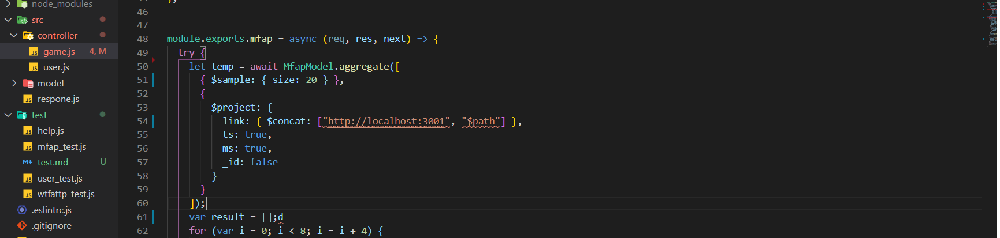
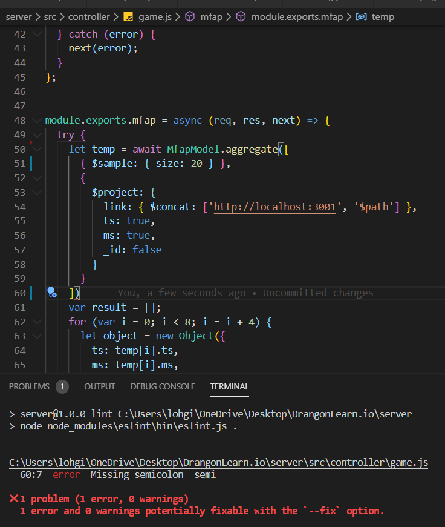
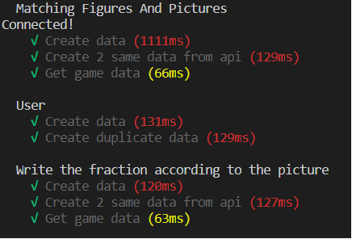

# TEST
### Tech
 `mocha eslint`
## run 
Hướng dẫn chạy test
    `npm run test`
    `npm run lint`
    `npm run lint:fix`
## Description
### Lint
 - Với eslint chúng ta có thể format lại code theo 1 chuẩn code, mỗi người trong nhóm sau khi code xong có thể chạy lint để cho code của mỗi người đều có format giống nhau, tiện lợi cho việc làm việc nhóm
 - Extension Eslint của Visual Studio Code là 1 công cụ hỗ trợ đắc lực. Đi cùng với cài đặt eslint vào project, công cụ này sẽ tùy chỉnh thông báo lỗi khi gặp nhưng lỗi ở config
 - Có thể dùng `npm run lint:fix` để eslint tự sửa 1 sỗ lỗi eslint hỗ trợ fix
 Ví dụ về eslint hỗ trợ thông báo lỗi format code   
 Ví dụ về eslint tìm lỗi ở code 
### Mocha
Một công cụ đắc lực để có thể kiểm tra các hàm của code
`npm run test`
Hiện tại test đã có thể kiểm tra các tính năng sau

1. Matching Figures And Pictures
 + Tạo game data
 + Check tạo trùng lặp game data
 + Lấy game data
2. Write the fraction according to the picture
 + Tạo game data
 + Check tạo trùng lặp game data
 + Lấy game data
3. User
 + Tạo User
 + Check trùng lặp user

 Chạy:
 
  
